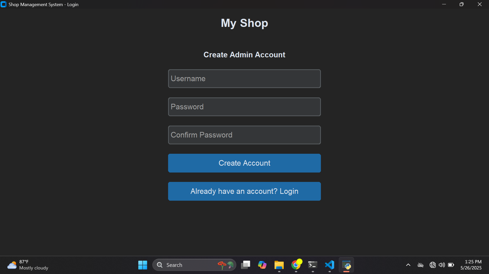
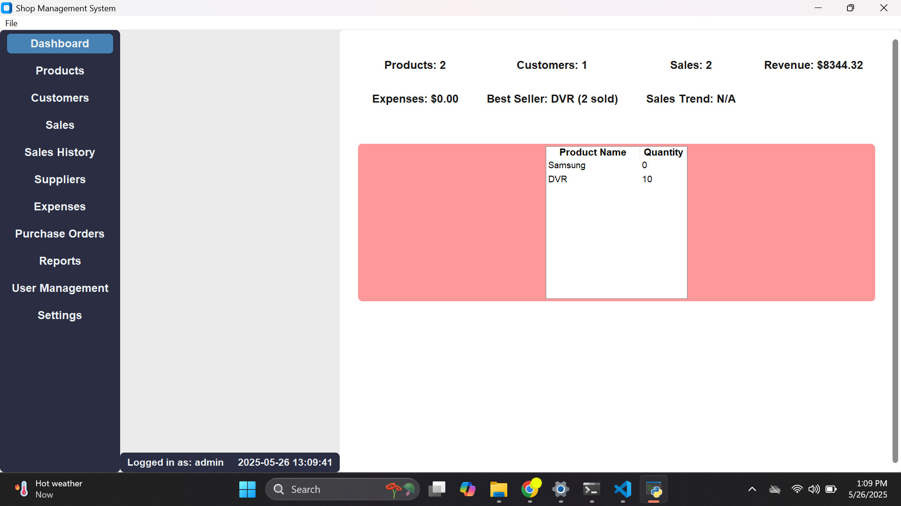
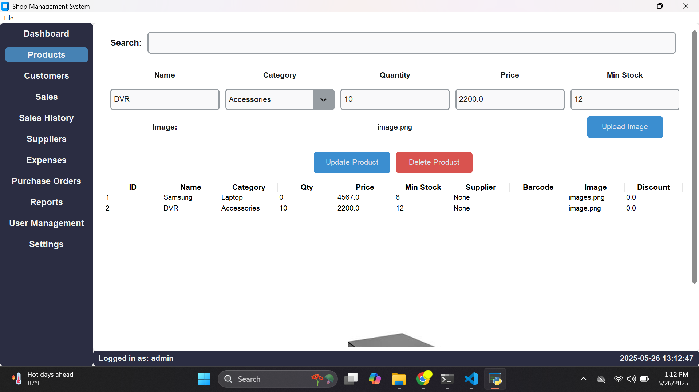
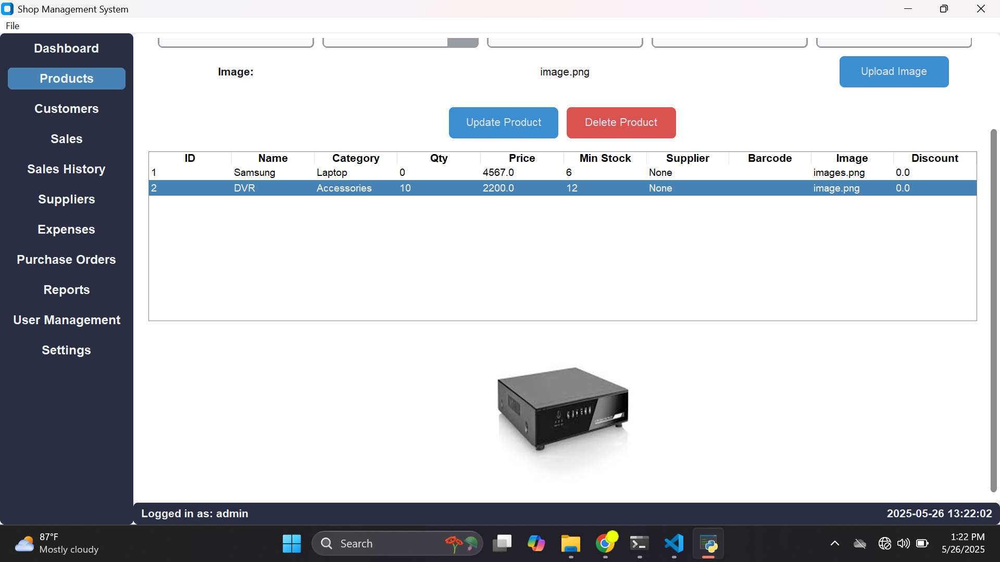
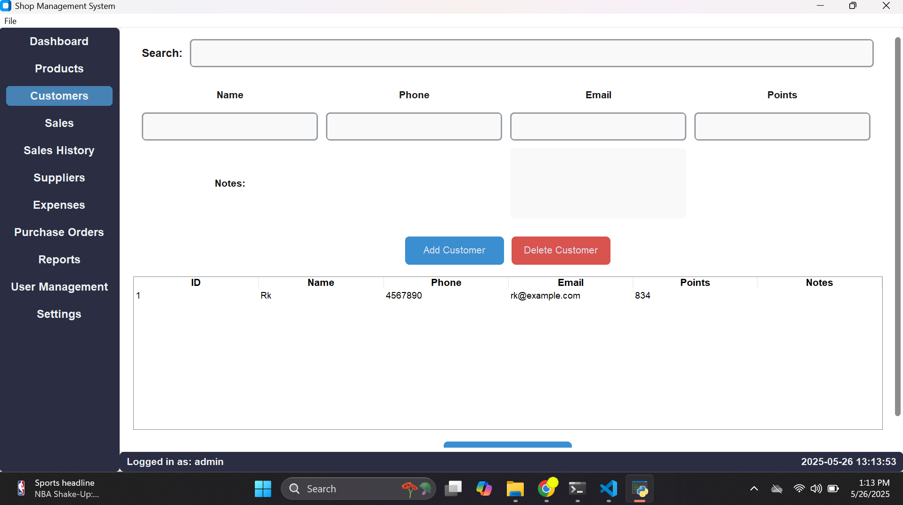

# 🚀 Inventory POS Shop Management Software for PC & Laptop
📦🔐🧾📊🧑‍💼💻

#### A complete solution to manage your shop, staff, sales, stock, and customer billing – all from your desktop or laptop.

# 🔑 Key Features:
1️⃣ Admin & Staff Account Creation
🔐 Role-based access for better security & control.

2️⃣ Secure Login System
✅ Staff can log in and perform sales only.

3️⃣ Intuitive Dashboard
Easily manage:

📦 Products

👥 Customers

💰 Sales

🧾 Sales History

🚚 Suppliers

💸 Expenses

📥 Purchase Orders

📈 Reports

👨‍💼 User Management

⚙️ Settings

4️⃣ Log Out
🔒 Secure logout feature for safety.

🌟 Advanced Supports:
📡 IoT Device Integration

Supports barcode scanner, POS printer, and receipt scanner.

📷 No IoT? Use your PC/Laptop WebCam to scan!

🔄 Product Return Policy

Handle returns smoothly with inventory updates.

👨‍💼 Staff Restrictions

Staff can only sell, no access to sensitive settings or reports.

# 📧 Automation Alerts

### Automatically send email or SMS reminders when a customer’s payment is overdue!

# 💼 Perfect for:
Retail Shops 🛍️

Grocery Stores 🛒

Electronics Shops 💻

Fashion Boutiques 👗

Bookstores 📚

💬 Interested in this powerful and professional POS software?
Message me now to get started!

# Demo

### Create Admin Accunt

### Dashbord 
 
### Product 

### Customer 
